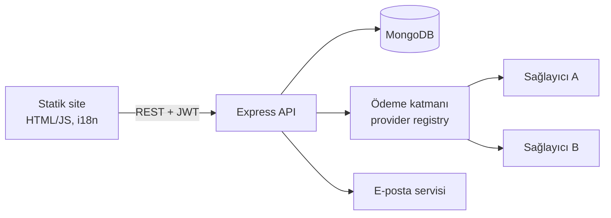

# Mobilya E-Ticaret

**Mobilya satışı için çok dilli e-ticaret sitesi ve yönetim paneli.**

> Kaynak kod private. Bu depo projenin tanıtım sayfasıdır. İstek üzerine demo yapılabilir.

## Özellikler

**Mağaza**
- Kategori ve ürün listeleme; varyantlı ürünler (renk, ölçü vb.)
- Fiyatı girilmemiş varyantlarda "WhatsApp'tan fiyat sor" akışı
- Misafir ve üye sepeti; oturum süresi dolunca misafir sepetine sorunsuz geçiş
- Çok dilli arayüz (i18n), il/ilçe seçimli adres formu
- KVKK, mesafeli satış sözleşmesi, iade ve teslimat sayfaları; çerez onayı

**Yönetim paneli**
- İki adımlı doğrulamalı (2FA) admin girişi
- Ürün, kategori, sipariş, ödeme, duyuru ve dil yönetimi
- Profil formları ve başvuru yönetimi

**Ödeme altyapısı**
- Sağlayıcıdan bağımsız ödeme katmanı: ortak arayüz (provider contract) ve sağlayıcı kayıt yapısı
- Birden fazla sağlayıcı adaptörü (kart, kripto, Neosurf vb.) ve test için sahte sağlayıcı
- Ödeme ayarları admin panelinden yönetilir

**Güvenlik ve altyapı**
- JWT kimlik doğrulama, bcrypt ile şifre hash'leme
- Helmet güvenlik başlıkları, rate limiting, NoSQL injection koruması, girdi doğrulama
- Stok güncellemelerinde MongoDB transaction ile yarış durumu (race condition) koruması
- Winston ile loglama, e-posta bildirimleri

## Mimari

## Teknolojiler

Node.js · Express · MongoDB / Mongoose · JWT · bcrypt · Helmet · express-rate-limit · express-validator · Nodemailer · Winston · HTML/CSS/JavaScript

<!-- Ekran görüntüleri: screenshots/ klasörüne ekleyip aşağıdaki satırları açın

-->
